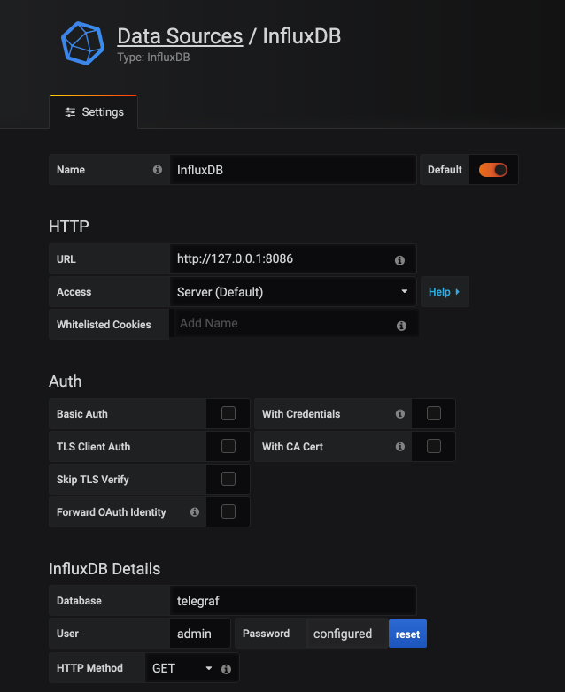
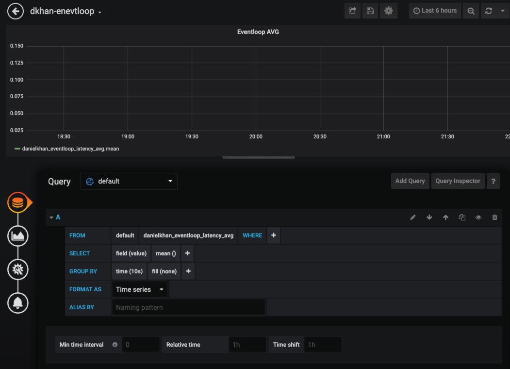
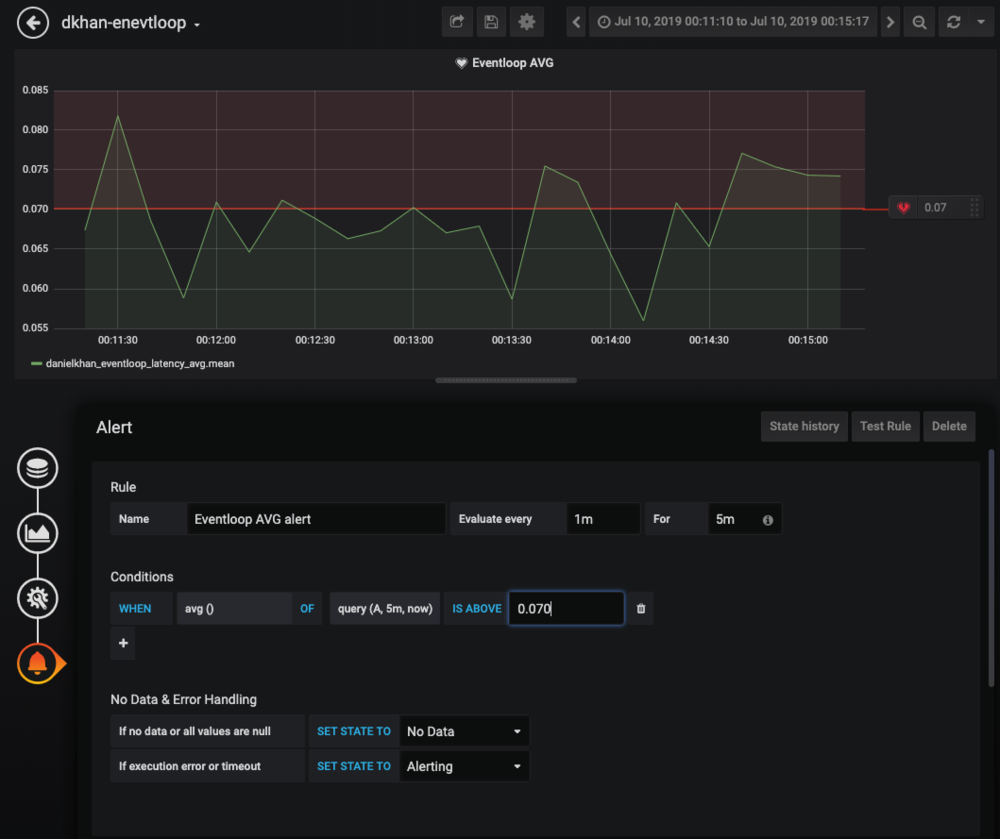

This repository contains material for my workshop Tracing Node.

# Setting up all services
1. Clone the repository `git clone git@github.com:danielkhan/tracing-node-workshop.git`.
2. Copy `/.env-sample` to `/.env`.
3. Fill in the information provided.
4. Create 4 terminal windows.
5. In each window, change into a service and run `npm install` followed by `npm start`.
6. Create one more window, change into `/monitoring` and run `npm install` there as well.


# Collecting metrics

## Server setup

To collect metrics, we need a server that contains services for receiving metrics
as well as some user interface.
For this workshop, this server exists already.

This provides the following services for our metrics monitoring solution:
- Telegraf: A dameon that can collect different kind of data and provides a statsd endpoint
- InfluxDB: A timeseries database
- Grafana: A user interface that lets us create dashboards from different datasources

To access Grafana, open our tracing host on port 3000.
The credentials will be provided during the workshop.

I have already configured an InfluxDB datasource in Grafana:


## Sending metrics from Node.js
Next we want to configure our services so that they collect metrics and send it
to the server.

For that, we will install a module that povides this out-of-the-box:

In `/monitoring`we run:
`npm install -S appmetrics-statsd`

In app.js:

```js


// express-frontend
const statspfx = `${process.env.MY_HANDLE}_express-frontend_`;
const statsd = require('appmetrics-statsd').StatsD(
  { host: process.env.COLLECTOR, prefix: statspfx}
);

// service-gateway
const expressStatsd = require('express-statsd');
const statspfx = `${process.env.MY_HANDLE}_express-frontend_`;
const statsd = require('appmetrics-statsd').StatsD(
  { host: process.env.COLLECTOR, prefix: statspfx }
);

// service-green
const expressStatsd = require('express-statsd');
const statspfx = `${process.env.MY_HANDLE}_service-green_`;
const statsd = require('appmetrics-statsd').StatsD(
  { host: process.env.COLLECTOR, prefix: statspfx }
);

// service-blue
const expressStatsd = require('express-statsd');
const statspfx = `${process.env.MY_HANDLE}_service-blue_`;
const statsd = require('appmetrics-statsd').StatsD(
  { host: process.env.COLLECTOR, prefix: statspfx }
);

```

Metrics descriptions https://github.com/RuntimeTools/appmetrics-statsd.

Hit `http://localhost:8080` a few times.


## Create a dashboard



## Define Alerts


## Create a Dashboard for memory_process_virtual
* Fix metric

## Create a dashboard that shows error 500
Add a dashboard that shows error 500 and 200.


Add a middleware for express metrics:

```js
app.use((req, res, next) => {
  var startTime = new Date().getTime();

  // Function called on response finish that sends stats to statsd
  function sendStats() {
    var key = 'http-express-';

    // Status Code
    var statusCode = res.statusCode || 'unknown_status';
    statsd.increment(key + 'status_code.' + statusCode);

    // Response Time
    var duration = new Date().getTime() - startTime;
    statsd.timing(key + 'response_time', duration);

    cleanup();
  }

  // Function to clean up the listeners we've added
  function cleanup() {
    res.removeListener('finish', sendStats);
    res.removeListener('error', cleanup);
    res.removeListener('close', cleanup);
  }

  // Add response listeners
  res.once('finish', sendStats);
  res.once('error', cleanup);
  res.once('close', cleanup);

  if (next) {
    next();
  }
})
```

Hit `http://localhost:8080` a few times.


# Install Jaeger Tracing

```bash
$ docker run -d --name jaeger \
  -e COLLECTOR_ZIPKIN_HTTP_PORT=9411 \
  -p 5775:5775/udp \
  -p 6831:6831/udp \
  -p 6832:6832/udp \
  -p 5778:5778 \
  -p 16686:16686 \
  -p 14268:14268 \
  -p 9411:9411 \
  jaegertracing/all-in-one:1.13
```

Frontend `http://tracing.khan.io:16686`.


# Install Opencensus Node

`npm install @opencensus/nodejs --save`

express-frontend: `app.js`
const tracing = require('@opencensus/nodejs');
tracing.start();

Hit `http://localhost:8080` a few times.


Install `npm install @opencensus/exporter-jaeger -S`

```js
// bin/www
const tracing = require('@opencensus/nodejs');
const JaegerTraceExporter = require('@opencensus/exporter-jaeger').JaegerTraceExporter;

const options = {
  serviceName: 'express-frontend',
  host: process.env.COLLECTOR,
}
const exporter = new JaegerTraceExporter(options);
tracing.start({ exporter });
```

Hit the webpage

Open `http://tracing.khan.io:16686`.

# Propagation

Add console.log(req.headers) to middleware in service-gateway

`npm install @opencensus/propagation-tracecontext -S`

const propagation = require('@opencensus/propagation-tracecontext');
const traceContext = new propagation.TraceContextFormat();

tracing.start({ exporter, propagation: traceContext });

Compare