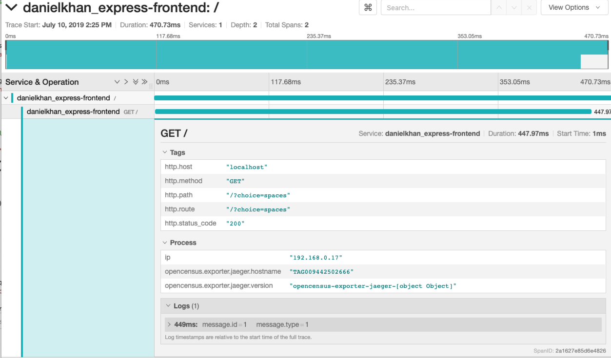

This repository contains material for my workshop Tracing Node.

# Setting up all services
1. Clone the repository `git clone https://github.com/danielkhan/tracing-node-workshop.git`.
2. Copy `/.env-sample` to `/.env`.
3. Fill in the information provided.
4. Create 4 terminal windows.
5. In each window, change into a service and run `npm install` followed by `npm start`.
6. Open `http://lcoalhost:8080` to try it out.

# Collecting metrics

## Server setup

To collect metrics, we need a server that contains services for receiving metrics
as well as some user interface.
For this workshop, this server exists already.

This provides the following services for our metrics monitoring solution:
- Telegraf: A dameon that can collect different kind of data and provides a statsd endpoint
- InfluxDB: A timeseries database
- Grafana: A user interface that lets us create dashboards from different datasources

To access Grafana, open our tracing host on port 3000.
The credentials will be provided during the workshop.

I have already configured an InfluxDB datasource in Grafana:


Of course we don't collect any metrics yet. We will set this up now.

## Sending metrics from Node.js
Next we want to configure our services so that they collect metrics and send it
to the server.

The `monitoring` project will be our central location for all monitoring related code.

We will install a module that povides us Node.js metricsout-of-the-box:

In `/monitoring`we run:
`npm install -S appmetrics-statsd`

This will install a native module.
If the install fails and you are on windows, make sure that you have the required build tools available.
To install the build tools, run `npm install --global windows-build-tools`.

Next open `/montoring/index.js` and add

```js
module.exports.metrics = (collector, handle, serviceName) => {
  const statsd = require('appmetrics-statsd').StatsD(
    { host: collector, prefix: `${handle}_${serviceName}_` }
  );
  return {
    statsd,
  }
};
```

This will set up statsd for us and start with metrics collection right away.

Of course, we have to add this module to our services.
So we open `app.js` in every service and add after `const serviceName ...`:

```js
const monitoring = require('../monitoring');
const metrics = monitoring.metrics(process.env.COLLECTOR, process.env.MY_HANDLE, serviceName);
```

Hit `http://localhost:8080` a few times.

In Grafana, all your metrics will be prefixed with your handle.
If you save a dashboard, make sure that you prefix it with your handle as well.

## Creating a dashboard in Grafana
Follow the instructions during the workshop.


## Define Alerts
Follow the instructions during the workshop.


## Task: Create a memory monitoring dashboard Dashboard
Replicate what we've learned so far to create a dashboard that gives us
memory_process_virtual.

You might see, that the values on the Y-axis are not very user friendly.
Follow the instructions in the workshop to fix this.

Find all metrics descriptions here: https://github.com/RuntimeTools/appmetrics-statsd.

## Create a metrics collection middleware
We also want to get a bit more information, like status codes drectly from express.
Unfortunately, `appmetrics-statsd´ won't give us that.

Let's create a middleware for this.

For that we go to `/monitoring/index.js` and add:

```js
const middleware = (req, res, next) => {
  var startTime = new Date().getTime();
  // Function called on response finish that sends stats to statsd
  function sendStats() {
    var key = 'http-express-';
    // Status Code
    var statusCode = res.statusCode || 'unknown_status';
    statsd.increment(key + 'status_code.' + statusCode);
    // Response Time
    var duration = new Date().getTime() - startTime;
    statsd.timing(key + 'response_time', duration);
    cleanup();
  }
  // Function to clean up the listeners we've added
  function cleanup() {
    res.removeListener('finish', sendStats);
    res.removeListener('error', cleanup);
    res.removeListener('close', cleanup);
  }
  // Add response listeners
  res.once('finish', sendStats);
  res.once('error', cleanup);
  res.once('close', cleanup);
  if (next) {
    next();
  }
}
```

Finally, we add this middleware to our services:

```js
const app = express();
app.use(metrics.middleware);
```
Restart the services and hit `http://localhost:8080` a few times again.

## Create a counter dashboard for error 500
Follow the instructions in the workshop.
The metric to look for is `<your_handle>_service-gateway_http-express`.

# Collecting traces
While metrics can give us valuable insights, traces connect the dots.
We will use Jaeger tracing as our backend and ui.
It's already available on our monitoring server.

You can reach the frontend at the monitoring server
on port `16686`.


The architecture behind Jaeger looks like that:


## Install Opencensus Node

The backend alone does not give us much.
We need to collect traces inside our services.

For that, we will use opencensus.

In `/monitoring` we install it by running
`npm install @opencensus/nodejs --save`

In our exported function, we add
```js
const tracing = require('@opencensus/nodejs');
tracing.start();
// and add it to the returned properties:
return {
  statsd,
  middleware,
  tracing,
}
```

This should set up tracing when the module is initialized.
Let's re-run all services and hit `http://localhost:8080` a few times.

If we wait roughly a minute, we will see that the console now starts spitting out tracing information.
This means, that the tracing functionality basically works but
right now, we only export it to the console.

We need to find a way to tell OpenCensus that it should export
to the Jaeger endpoint at the monitoring host.

## Exporting traces to Jaeger

Luckily, there is an exporter für Jaeger available.
So in `/monitoring` we run `npm install @opencensus/exporter-jaeger -S`

Next we will extend the monitoring module:
```js
  const tracing = require('@opencensus/nodejs');
  const JaegerTraceExporter = require('@opencensus/exporter-jaeger').JaegerTraceExporter;
  const options = {
    serviceName: `${handle}_${serviceName}`,
    host: collector,
  }
  const exporter = new JaegerTraceExporter(options);
  tracing.start({ exporter });
```

Restart all services and hit the webpage a few times.

Open the jaeger UI on the tracing server on port `16686`.
You should find services prefixed with your handle there.



If we look at the traces starting from `express-service` we see that
the rsult is not exactly what we wanted to see.
We wanted distributed tracing but we only see the outbound call as a span but
no connection to the other services.

Obviously, Jaeger and OpenCensus have no way to correlate those different invocations together.
This is where context propagation comes into place.

Let's get a bit more insights by adding `console.log(req.headers)` to the metrics
middleware for the sake of debugging.
Restart all services and hit the app.
We see that the headers passed between the services don't contain any context information.

This is because we need to explicitely enable context propagation in OpenCensus and
we also have to choose a format. We will use the new w3c standard `trace-cntext` for that.

## Add context propagation

In `/monitoring` we run.

`npm install @opencensus/propagation-tracecontext -S`

And we add to the monitoring function:

```js
const propagation = require('@opencensus/propagation-tracecontext');
const traceContext = new propagation.TraceContextFormat();

tracing.start({ exporter, propagation: traceContext });
```

Let's restart all services and try it again.
We see that now we have a new header `traceparent` that contains the context information
that is needed to correlate transactions between services.

If we head back to Jaeger, we now have long traces through all services.


## Comparing traces
Now to debug the problem we are having (the error 500), we can compare different traces.
Let's do that.

Select a trace that uses `service-green` and one that uses `service-blue` and click
`Compare traces` and the resulting graph cleary tells us that calls to `service-blue` are
failing.

